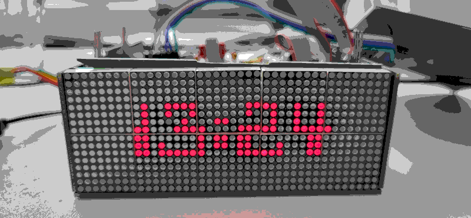

# Convert64C

Convert64C translates a Commodore 64 font in 64c format to the
Adafruit GFX font / C structure.

This makes old good low-pixel count fonts accessible for use in low
pixel count screens.



In the 64c format each font glyph consists of 8 horizontal lines,
notated as 8 individual bytes. The files I found on the web typically
have 2 initial bytes that differ in contents. Successive glyphs are
simply the next 8 bytes, and glyph ordering is C64 standard.

In the adafruit format a font has a bitmap and separate explicit glyph
definition. The glyph definition details offset into bitmap, width and
height. Glyphs of different sizes (taking into account a long
descender, or using less space for a point instead of an x) are
possible.

# Compaction

When the font is **not** compacted the bitmaps between adafruit and 64c
are the same[^1], and glyphs will be 8x8 in size.

When the font **is** compacted we remove all empty vertical lines and
adjust the glyph definitions to boot. Width and height will be set to
the detected pixel width and height + 1.

Example of first two glyphs of uncompacted font "action_wave":

```c
    const uint8_t font_action_wave_bitmap[] = {

        /* Character 0x20 : " " (0,0)-(0,0)
         * ........
         * ........
         * ........
         * ........
         * ........
         * ........
         * ........
         * ........
         */
         0x00, 0x00, 0x00, 0x00, 0x00, 0x00, 0x00, 0x00,

     /* Character 0x21 : "!" (3,0)-(5,6)
         * ...xx...
         * ...xx...
         * ...xxx..
         * ...xxx..
         * ........
         * ...xxx..
         * ...xxx..
         * ........
         */
         0x18, 0x18, 0x1c, 0x1c, 0x00, 0x1c, 0x1c, 0x00,
    };

    const glyph_t font_action_wave_glyph[] = {
        {0, 8, 8, 8, 0, -8},  /* 20 :   */
        {8, 8, 8, 8, 0, -8},  /* 21 : ! */
    };
```

With compaction:
```c
    const uint8_t font_action_wave_bitmap[] = {
        /* Character 0x20 : " " (0,0)-(0,0)
         * .
         */
         0x00,

        /* Character 0x21 : "!" (0,0)-(2,6)
         * xx.
         * xx.
         * xxx
         * xxx
         * ...
         * xxx
         * xxx
         */
         0xdb, 0xf1, 0xf8,
    };

    const glyph_t font_action_wave_glyph[] = {
        {0, 1, 1, 2, 0, -8},  /* 20 :   */
        {1, 3, 7, 4, 0, -8},  /* 21 : ! */
    };
```

[^1]: The C64 bitmap is sorted in C64 glyph order, the Adafruit bitmap
    is sorted in ascii order.

# Minimal drawing routine

More information on the Adafruit font definition, and how to use them
can be found in the [Adafruit GFX
Library](https://github.com/adafruit/Adafruit-GFX-Library/blob/master/Adafruit_GFX.cpp). Here
is an example of how I adjusted their drawChar routine for use on a
ledmatrix:

```c
    uint8_t
    matrix_draw_glyph(uint8_t x, uint8_t y, 
                      glyph_t *glyph, uint8_t *bitmap,
                      uint8_t color, uint8_t intensity)
    {
        uint16_t bo = glyph->offset;
        uint8_t w = glyph->width,
            h = glyph->height;
        int8_t xo = glyph->x_offset,
            yo = glyph->y_offset;
        uint8_t xx, yy, bits = 0, bit = 0;

        for (yy = 0; yy < h; yy++) {
            for (xx = 0; xx < w; xx++) {
                if (!(bit++ & 7)) {
                    bits = bitmap[bo++];
                }
                if (bits & 0x80) {
                    matrix_set(x + xo + xx,
                               y + yo + yy,
                               color,
                               intensity);
                }
                bits <<= 1;
            }
        }
        return (x + xo + xx);
    }

    void
    matrix_print_char(uint8_t x, uint8_t y, 
                      uint8_t color, uint8_t intensity, char s)
    {
        glyph_t *glyph;
        uint8_t *bitmap = system_font->bitmap;
        unsigned char c;

        c = s - system_font->first;
        glyph = &system_font->glyph[c];
        matrix_draw_glyph(x, y, glyph, bitmap, color, intensity);
    }

    void
    matrix_print(uint8_t x, uint8_t y, 
                 uint8_t color, uint8_t intensity, char *s)
    {
        glyph_t *glyph;
        uint8_t *bitmap = system_font->bitmap;
        unsigned char c;

        while (*s != 0) {
            c = *s - system_font->first;
            glyph = &system_font->glyph[c];
            matrix_draw_glyph(x, y, glyph, bitmap, color, intensity);
            x += glyph->width + 1;
            if (x > MATRIX_MX) {
                y += system_font->y_advance;
                x = 0;
            }
            s++;
        }
    }
```
# Assumptions

- All 64c fonts are 8x8 -- wrong! -- there are larger fonts, but those
  are structured internally as 8x8. Multiple glyphs must be stacked to
  get the larger font glyphs.

- The glyphs in the input file are assumed to be ordered as per
  Commodore 64 firmware:

```
    @abcdefghijklmnopqrstuvwxyz[£]↑←
     !\"#$%&'()*+,-./0123456789:;<=>?
    ━ABCDEFGHIJKLMNOPQRSTUVWXYZⵜ▚|▒
```
- The fonts in the example directory are assumed to be out of
  copyright. Please contact me if you know different.

# Resources

- Adafruit:  [GFX Library](https://github.com/adafruit/Adafruit-GFX-Library)
- Peter Kofler: [c64 charset galleries](http://home-2002.code-cop.org/c64/font_01.html)
